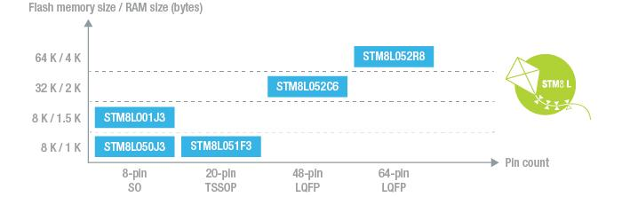

# [STM8L0x](https://github.com/sochub/STM8L0) 

 

#### 父级：[STM8L](https://github.com/sochub/STM8L)

#### 架构：[STM8](https://github.com/sochub/STM8)

## [描述](https://github.com/sochub/STM8L0/wiki) 

ST低成本低功耗解决方案，可用于极简的低功耗设备中，推荐的型号为STM8L051F3

 

### [内部收录](https://github.com/sochub/STM8L0)

STM8L0x系列和[STM8L15x](https://github.com/sochub/STM8L15) 的官方驱动文件一致，相应的工程可以通用。

* [文档](docs/)
* [资源](src/)
    * [Bootloader](src/Bootloader)
    * [IAR](src/IAR)
    * [STVD](src/STVD)
    * [SDCC](src/SDCC)

### [外部收录](https://github.com/sochub/STM8)

* [Arduino for STM8](https://github.com/stm32duino/Arduino_Core_STM8)

### [选型建议](https://github.com/sochub/STM8L0)

替换方案[STM8L10x](https://github.com/sochub/STM8L10) 

升级方案[STM8L15x](https://github.com/sochub/STM8L15)

极低功耗方案可以考虑TI的[MSP430](https://github.com/sochub/MSP430)

##  [SoC资源平台](http://www.qitas.cn)  
