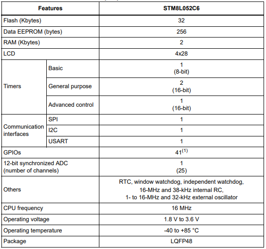

# [STM8L052](https://github.com/SoCXin/STM8L052)

* [ST](https://www.st.com/zh/): [STM8](https://github.com/SoCXin/8051)
* [L1R2](https://github.com/SoCXin/Level): 16 MHz

## [简介](https://github.com/SoCXin/STM8L052/wiki)

[STM8L052](https://github.com/SoCXin/STM8L052)超值超低功耗微控制器为成本敏感型应用提供了最佳性价比。 超值系列具有与STM8L151/152系列类似的内核性能和外设集，优化了特性和配置，从而能够达到预算价格。

STM8L基于8位STM8内核，与STM32L系列一样采用了专有超低漏电流工艺，利用最低功耗模式实现了超低功耗（0.30 uA）

### 关键特性

* 2 Kbytes of SRAM
* 1 Kbytes of EEPROM
* 32 Kbytes of Flash
* 12-bit ADC and DAC

### [资源收录](https://github.com/SoCXin)

* [参考资源](src/)
* [相关文档](docs/)
* [典型应用](project/)

### [选型建议](https://github.com/SoCXin)

[STM8L052](https://github.com/SoCXin/STM8L052)相较[STM8L152](https://github.com/SoCXin/STM8L152)没有DAC和比较器。

### [探索芯世界 www.SoC.xin](http://www.SoC.Xin)
