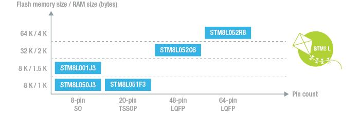

# [STM8L052](https://github.com/SoCXin/STM8L052)

* [ST](https://www.st.com/zh/): [STM8](https://github.com/SoCXin/8051)
* [L1R2](https://github.com/SoCXin/Level): 16 MHz

## [简介](https://github.com/SoCXin/STM8L052/wiki)

[STM8L052](https://github.com/SoCXin/STM8L052)

### 关键特性

* 4 Kbytes of SRAM
* 2 Kbytes of EEPROM
* 64 Kbytes of Flash
* 12-bit ADC and DAC

### [资源收录](https://github.com/SoCXin)

* [参考资源](src/)
* [相关文档](docs/)
* [典型应用](project/)

### [选型建议](https://github.com/SoCXin)

[STM8L052](https://github.com/SoCXin/STM8L052)

### [探索芯世界 www.SoC.xin](http://www.SoC.Xin)
